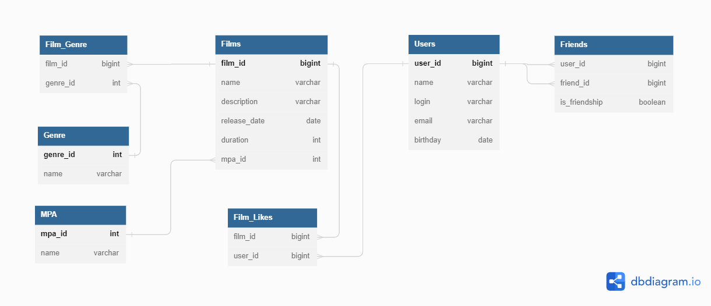

# Приложение Filmorate


# ER-диаграмма

[Ссылка на редактор ER-диаграммы](https://dbdiagram.io/d/63fdfe13296d97641d84554c)

## Примеры SQL-запросов

###### Получение всех фильмов:
```
SELECT *
FROM films;
```
###### Получение фильма по id:
```
SELECT *
FROM films
WHERE film_id = id;
```
###### Получение всех пользователей:
```
SELECT *
FROM users;
```
###### Получение пользователя по id:
```
SELECT *
FROM users
WHERE user_id = id;
```

